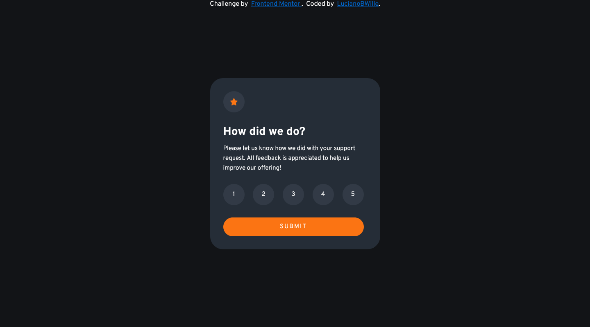
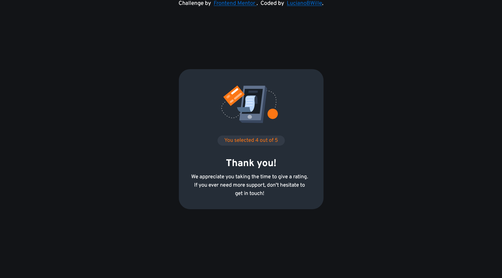
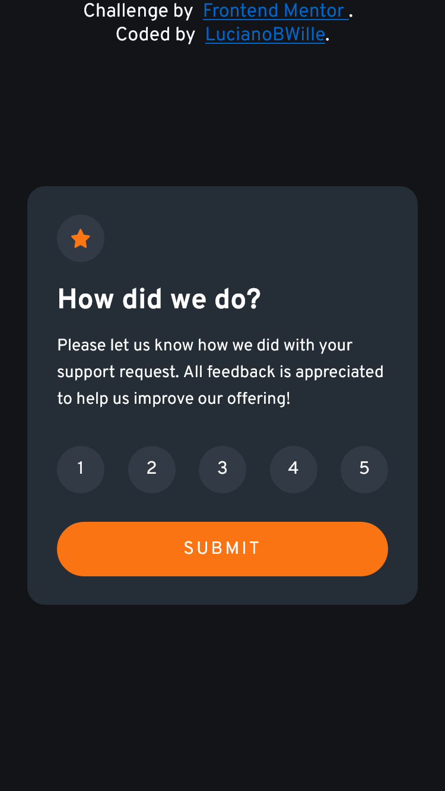
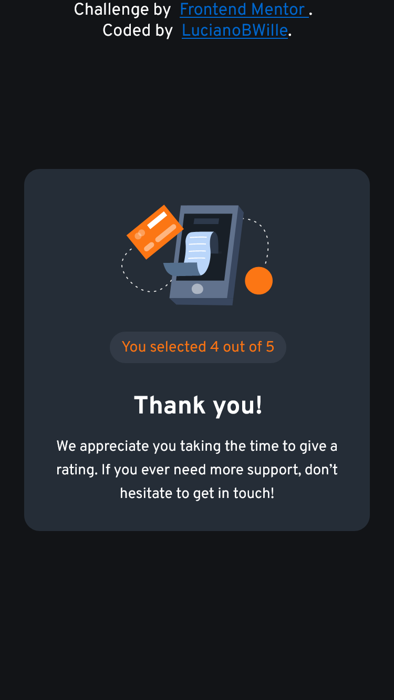

# Frontend Mentor - Interactive rating component solution

This is a solution to the [Interactive rating component challenge on Frontend Mentor](https://www.frontendmentor.io/challenges/interactive-rating-component-koxpeBUmI). Frontend Mentor challenges help you improve your coding skills by building realistic projects. 

## Table of contents

- [Frontend Mentor - Interactive rating component solution](#frontend-mentor---interactive-rating-component-solution)
  - [Table of contents](#table-of-contents)
  - [Overview](#overview)
    - [The challenge](#the-challenge)
    - [Screenshots](#screenshots)
      - [Desktop](#desktop)
      - [Mobile](#mobile)
    - [Links](#links)
  - [My process](#my-process)
    - [Built with](#built-with)
    - [Continued development](#continued-development)
  - [Author](#author)

## Overview

### The challenge

Users should be able to:

- View the optimal layout for the app depending on their device's screen size
- See hover states for all interactive elements on the page
- Select and submit a number rating
- See the "Thank you" card state after submitting a rating

### Screenshots

#### Desktop

  
  

#### Mobile

  
  

### Links

- Solution URL: https://github.com/LucianoBWille/Interactive-rating-component-FrontEndMentorChallenge
- Live Site URL: https://lucianobwille.github.io/Interactive-rating-component-FrontEndMentorChallenge/

## My process

- I put the design image in the background of the body
- I wrote the HTML with the content
- Then I put opacity on the container section, so I could see the image behind the content
- Seeing the design behind the content I was able to fit the style to be as faithful as possible.

### Built with

- Semantic HTML5 markup
- CSS custom properties
- Flexbox

### Continued development

Two tools that I intend to use for future projects:
1. Figma: rebuild the design layout to aid in development.
2. SASS: to make the CSS more optimized

## Author

<!-- - Website - [LucianoBWille](https://lucianobwille.github.io/) -->
- LinkedIn - [LucianoBWille](https://www.linkedin.com/in/lucianobwille/)
- Github - [LucianoBWille](https://github.com/LucianoBWille)
- Frontend Mentor - [@LucianoBWille](https://www.frontendmentor.io/profile/LucianoBWille)
